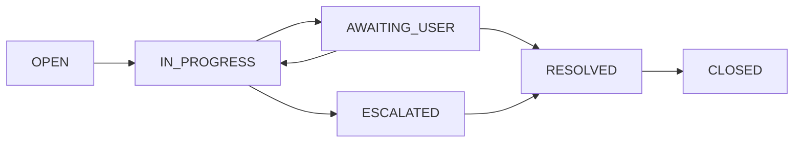

# Jira Ticketing System Lab 🎟️


**Profesjonalna symulacja operacji IT Support z wykorzystaniem Jira Service Management (Atlassian) i diagnostyki Windows. Scenariusze oparte na celach certyfikacji CompTIA A+.**


---


## Spis treści


- [O projekcie](#o-projekcie)

- [Technologie](#technologie)

- [Struktura projektu](#struktura-projektu)

- [Scenariusze zgłoszeń](#scenariusze-zgłoszeń)

- [Workflow](#workflow)

- [Screenshoty](#screenshoty)

- [Czego się nauczyłem](#czego-się-nauczyłem)

- [Autor](#autor)


---


## O projekcie


Projekt został zaprojektowany tak, aby odwzorować realne zadania wykonywane na stanowisku Helpdesk / IT Support Specialist. Główne cele:


   • Praktyczna nauka obsługi systemu ticketowego Jira Service Management w kontekście wsparcia IT

   • Poznanie cyklu życia zgłoszenia: przyjęcie, diagnoza, rozwiązanie, zamknięcie

   • Ćwiczenie priorytetyzacji zadań (Low / Medium / High) i reakcji na incydenty

   • Dokumentowanie rozwiązań w sposób zrozumiały zarówno dla użytkownika, jak i dla kolejnego technika

   • Symulacja komunikacji z użytkownikiem końcowym

   • Zbudowanie portfolio technicznego z konkretnym, weryfikowalnym przykładem pracy


## Technologie


| Narzędzie | Wersja / Plan | Zastosowanie |
|-----------|--------------|--------------|
| Jira Service Management (Atlassian) | Free |  system ticketowy  |
| Windows 11 | — |  środowisko docelowe  |
| PowerShell / CMD | wbudowany |  diagnostyka  |
| GitHub | — |  dokumentacja  |


## Struktura projektu


```
jira-ticketing-system-lab

├── README.md
├── screenshots
│   ├── 01_ticketing_system_board.png
│   ├── 02_ticket_list.png
│   ├── 03_JTSL1_resolved.png
│   ├── 04_JTSL4_resolved.png
│   ├── 05_JTSL2_resolved.png
│   ├── 06_JTSL8_escalated.png
│   ├── 07_JTSL3_resolved.png
│   └── 08_JTSL5_escalated.png
└── tickets
     └── tickets_summary.md
```


## Scenariusze zgłoszeń


| ID | Tytuł | Priorytet | Kategoria | Status |
|----|-------|-----------|-----------|--------|
| JTSL1 | Nie mogę się zalogować – konto zablokowane | 🔴 HIGH | Konta |  RESOLVED  |
| JTSL2 | Brak dysku Z: | 🟡 MEDIUM | Sieć | RESOLVED  |
| JTSL3 | Drukarka w pokoju 204 nie drukuje – czeka kilka osób | 🟡 MEDIUM | Sprzęt |  RESOLVED  |
| JTSL4 | Brak internetu i brak dostępu do CRM – nie mogę pracować | 🔴 HIGH | Sieć |  RESOLVED  |
| JTSL5 | Komputer działa bardzo wolno, nie mogę otworzyć pliku Excel | 🟡 MEDIUM | Wydajność |  ESCALATED  |
| JTSL8 | Kliknąłem link w mailu i chyba coś się stało – proszę o pomoc | ‼️ HIGHEST | Bezpieczeństwo |  ESCALATED  |


## Workflow


- Diagram statusów

## Workflow



## Opis każdego statusu

**OPEN** - oznacza, że ticket został utworzony przez użytkownika i czeka aż któryś z techników go podejmie

**IN PROGRESS** - oznacza, że technik rozpoczął pracę nad rozwiązaniem problemu

**AWAITING USER** - Technik zrobił co mógł po swojej stronie ale żeby rozwiązać problem potrzebne jest konkretne działanie użytkownika

**ESCALATED** - Technik zbadał problem ale nie ma uprawnień lub kompetencji aby go rozwiązać. Problem przeniesiono wyżej.

**RESOLVED** - Problem został pomyślnie rozwiązany


## Zasady ogólne

- Podczas obsługi zgłoszeń istotne jest aby priorytetyzować swoje działanie. Służy do tego wbudowana funkcja ustalania priorytetu zgłoszenia. Przykładowo JTSL8 (Incydent bezpieczeństwa) będzie miał zdecydowanie wyższy priorytet niż JTSL5 (Wolne działanie komputera) z powodu wpływu dany problem może mieć na całą firmę i ciągłość biznesową.

- Praca ze zgłoszeniami wymaga od technika jasnej i klarownej komunikacji z użytkownikiem na każdym etapie rozwiązywania problemu. Użytkownik musi być informowany o postępach w formie zrozumiałej dla osoby nietechnicznej. Technik powinien unikać używania żargonu lub slangu branżowego.

- Praca z użytkownikiem często wiąże się ze zdenerwowaniem lub irytacją użytkownika. Kluczowym elementem tego procesu jest opanowanie i empatia. Użytkownik powinien czuć się zrozumiany i wysłuchany.

- Technik nie powinien zakładać, że zna rozwiązanie problemu nawet gdy wydaje mu się, że jest o tym przekonany. Ważnym etapem rozwiązywania zgłoszeń jest dopytywanie użytkownika o szczegóły problemu tak aby poszerzyć swoje spojrzenie na daną nieprawidłowość.

- W przypadku pilnych zgłoszeń istotne jest opracowanie planu B aby zachować ciągłość biznesową. Przykład. Zgłoszenie JTSL 4 - Konfiguracja Wi-Fi dla pracownika w przypadku nierozwiązania problemu

- Po rozwiązaniu zgłoszenia i ustaleniu przyczyny warto dodać notatkę wewnętrzną dzięki czemu jeśli problem się powtórzy znacznie ułatwi to diagnozę.


## Przykłady z projektu - realizacja w kolejności zgodnej z ustalonym priorytetem.


**Pełna dokumentacja odpowiedzi technika i komentarze do użytkowników dostępne na screenach w folderze `/screenshots`**


- Zgłoszenie JTSL 8 (Bezpieczeństwo) 

> [screenshots/06_JTSL8_escalated.png](screenshots/06_JTSL8_escalated.png)

Pracownik kliknął w podejrzany link. To krytyczna sytuacja zagrażająca całej firmie. Zgłoszenie zostało eskalowane wyżej, a do użytkownika wysłano zrozumiałą instrukcję postępowania zgodną z najlepszymi praktykami w przypadku ryzyka infekcji malware na system firmowy:

  	1. Izolacja komputera na którym doszło do incydentu od reszty sieci firmowej poprzez wyłączenie Wi-Fi lub odłączenie kabla RJ-45
	2. Reset hasła konta firmowego w domenie
	3. Prośba o informację czy hasło konta firmowego w domenie było używane do innych usług firmowych takich jak np. VPN


- Zgłoszenie JTSL 4 (Sieć) 

> [screenshots/04_JTSL4_resolved.png](screenshots/04_JTSL4_resolved.png)

Pracownik zgłosił problemy z połączeniem sieciowym oraz potrzebę pilnego rozwiązania (spotkania z klientami). Pracownik przekazał informację sugerujące nieprawidłowości w warstwie fizycznej co udało się potwierdzić poprzez zaproponowaną kolejność kroków diagnostycznych:

	1. Poprawność połączenia (ROOT CAUSE)
	2. Weryfikacja uszkodzeń kabla
	3. Weryfikacja uszkodzeń gniazda sieciowego

- Zgłoszenie JTSL 1 (Konta)

> [screenshots/03_JTSL1_resolved.png](screenshots/03_JTSL1_resolved.png)

Pracownik zgłosił zablokowane konto firmowe. Blokada została spowodowana wielokrotnymi nieudanymi próbami logowania. Z przyczyn ograniczenia ryzyka ataków typu Brute Force w Active directory jest ustawiona polityka blokady hasła po kilku nieudanych próbach logowania. Użytkownikowi zaproponowano następujące kroki:

	1. Odblokowanie konta oraz ustawienie hasła tymczasowego
	2. Zmiana hasła przez użytkownika
	3. Aktualizacja hasła na innych urządzeniach korzystających z konta firmowego


- Zgłoszenie JTSL 2 (Sieć) 

> [screenshots/05_JTSL2_resolved.png](screenshots/05_JTSL2_resolved.png)

Użytkownik zgłasza braku dostępu do dysku Z: w zasobach sieciowych po urlopie. Po dłuższej nieobecności Windows potrafi "zapomnieć" mapowania dysku sieciowego lub mogły wygasnąć poświadczenia konta. Skoro kolega obok widzi dysk problem najprawdopodobniej leży w konfiguracji lub uprawnieniach. Polecono użytkownikowi ręczne zmapowanie dysku Z: przez GUI z pomocą szczegółowych instrukcji.
	


- Zgłoszenie JTSL 5 (Wydajność/Software) 

> [screenshots/08_JTSL5_escalated.png](screenshots/08_JTSL5_escalated.png)

Pracownik zgłasza spowolnione działanie 4 letniej maszyny. Podejrzewa wirusa ale informuje, że nic nowego ostatnio nie było instalowane. Najbardziej prawdopodobną przyczyną jest działanie aplikacji w tle zużywających pamięć ale będzie potrzebna dodatkowa weryfikacja. Kolejnym potencjalnym problemem powodującym spowolnienie może być przegrzewanie się komputera jeśli od 4 lat nie był czyszczony. Malware to mało prawdopodobna przyczyna w tym przypadku ale nie warto jej wykluczać. Z uwagi na fakt, że Pani Joanna nie jest osobą techniczną, a połączenie zdalne może być utrudnione przez powolne działanie komputera najszybszą opcją rozwiązania problemu będzie wizyta przy stanowisku pracy Pani Joanny. Wykonano następujące kroki:
 	
	1. Weryfikacja obciążenia komponentów przy pomocy Task Managera - procesy w tle, programy w autostarcie - wykazano 100% użycia pamięci RAM.
	2. Zastosowano tymczasowe rozwiązanie w postaci wyłączenia nieużywanych aplikacji w tle. Polecono użytkownikowi tymczasowo wstrzymać się z używaniem kilku aplikacji jednocześnie.
	3. Zlecono rozszerzenie pamięci RAM w komputerze użytkownika (eskalacja)
	


- Zgłoszenie JTSL 3 (Sprzęt)

> [screenshots/07_JTSL3_resolved.png](screenshots/07_JTSL3_resolved.png)

Użytkownik zgłasza problem z drukarką - działa ale nie drukuje. Najbardziej prawdopodobną przyczyną będzie zawieszony Print Spooler lub problemy drukarki w połączeniu z siecią. Wykonano następujące kroki:

	1. Użycie narzędzia ping na adres IP drukarki - potwierdzono dostępność w sieci
	2. Wyczyszczenie kolejki drukowania oraz restart usługi Spooler - print server
	3. Polecono użytkownikowi restart zasilania - rozwiązuje problem gdy w kolejce druku jest uszkodzony plik
	4. Zaproponowano użytkownikowi wyjście awaryjne


## Screenshoty


- Widok Board – Jira Service Management

> [screenshots/01_ticketting_system_board.png](screenshots/01_ticketting_system_board.png)


- Lista zgłoszeń

> [screenshots/02_ticket_list.png](screenshots/02_ticket_list.png)


## Czego się nauczyłem


- Konfiguracja Jira Service Management na platformie Atlassian
- Obsługa workflow i zarządzanie statusami zgłoszeń
- Diagnostyka najczęstszych problemów
- Diagnostyka warstwy fizycznej sieci (kabel, gniazdo, lampka NIC)
- Pierwsza reakcja na incydent phishingowy — izolacja, reset hasła, eskalacja
- Analiza zużycia zasobów przez Task Manager (RAM 100%)
- Ręczne mapowanie dysku sieciowego przez GUI
- Praktyczne zastosowanie eskalacji — kiedy i jak przekazać ticket wyżej
- Dokumentowanie kroków przed eskalacją tak żeby kolejny technik miał pełny kontekst
- Odpowiednia komunikacja z użytkownikiem końcowym
- Zarządzanie oczekiwaniami użytkownika w sytuacjach krytycznych
- Dodawanie komentarzy publicznych (Odpowiedz klientowi) vs notatek wewnętrznych (Dodaj notatkę wewnętrzną) — i kiedy używać którego

---


## **👨‍💻** Autor


**Mateusz Markiewicz** - Projekt zrealizowany w ramach praktycznej nauki i stanowi część portfolio

